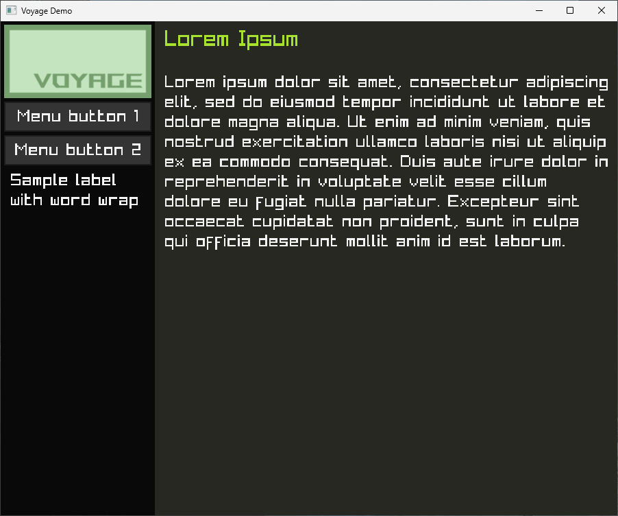

> Simple GUI application framework made on top of Raylib.


## Demo


``` c
#include "voyage/export.h"

void buttonOnClick() {
	printf("Menu button clicked\n");
}

int main() {
	SetConfigFlags(FLAG_WINDOW_RESIZABLE);
	InitWindow(900, 720, "Voyage Demo");
	SetTargetFPS(60);
	
	int width = GetScreenWidth(), height = GetScreenHeight();
	Sidebar sidebar = Sidebar_Init((Vector2){width, height}, Voyage_Brown);
	Image image = LoadImage("./images/logo.png");
	Sidebar_AddElement(&sidebar, &ImageContainer_EleInit(Vector2Dummy, (Vector2){100, 100}, &image));
	Sidebar_AddElement(&sidebar, &Button_EleInit(Vector2Dummy, 0, "Menu button 1", &buttonOnClick));	
	Sidebar_AddElement(&sidebar, &Button_EleInit(Vector2Dummy, 0, "Menu button 2", NULL));
	
	while (!WindowShouldClose()) {
		width = GetScreenWidth(), height = GetScreenHeight();
		Sidebar_Resize(&sidebar, (Vector2){width, height});
		
		BeginDrawing();
		ClearBackground(Voyage_DarkBrown);
		Sidebar_Draw(sidebar);
		EndDrawing();
	}
	CloseWindow();
	
	return 0;
}
```

## Quick Start
- Build and install [Raylib](https://github.com/raysan5/raylib?tab=readme-ov-file#build-and-installation).
- Run the demo using `make`.
